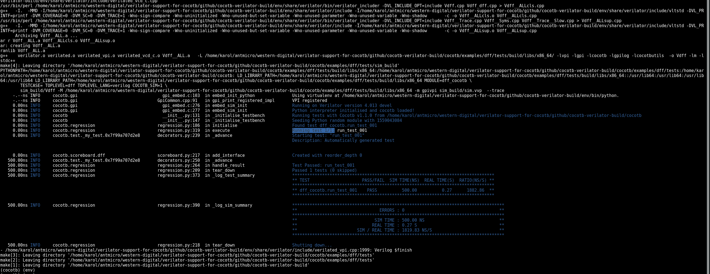

# Verilator+cocotb integration quick start guide

1. Install dependencies:

   ```
   sudo apt-get install virtualenv build-essential
   sudo apt-get install python3-dev
   sudo apt install gtkwave

   ```
 

2. Clone the repository:

   ```
   git clone https://github.com/antmicro/cocotb-verilator-build.git build
   ```

3. Change working directory to cloned repository:

   ```
   cd build
   ```

4. Download missing submodules:

   ```
   git submodule update --init
   ```

5. Build and install Verilator in local environment

   ```
   make env/bin/verilator
   ```

6. Install cocotb in local environment:

   ```
   make env/bin/cocotb-config
   ```

# Examples

To run the examples included in Cocotb, simply run `make cocotb/name_of_the_example/run`.
To clean the directory with the examples execute `make cocotb/name_of_the_example/clean`.

Running the `adder` example:

    make cocotb/adder/run

Runing the `D flip-flop` example:

    make cocotb/dff/run

Running `axi_lite_slave`:

    make cocotb/axi_lite_slave/run

To dump a vaweform from the simulation set the `VERILATOR_TRACE=1` env variable e.g:

    VERILATOR_TRACE=1 make cocotb/dff/run

The vaweform file is written in the example folder. `gtkwave` can be used for viewing it e.g:

    gtkwave cocotb/examples/dff/tests/dump.vcd

An example waveform you should get is shown below:


An example test output is shown in the picture bellow:


